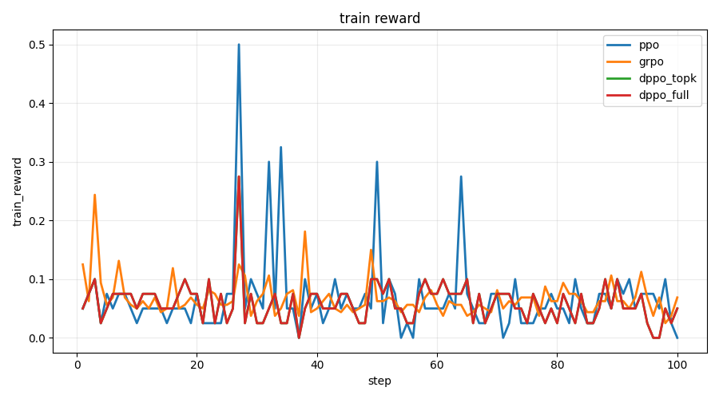
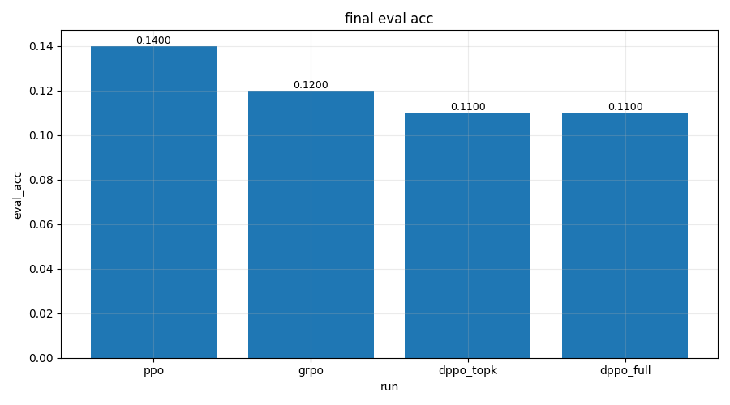
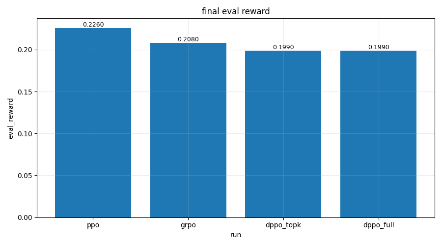
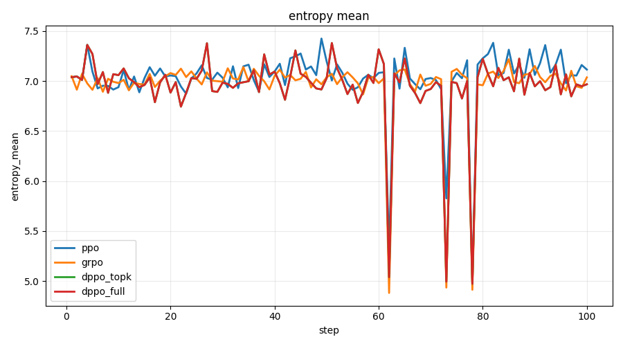
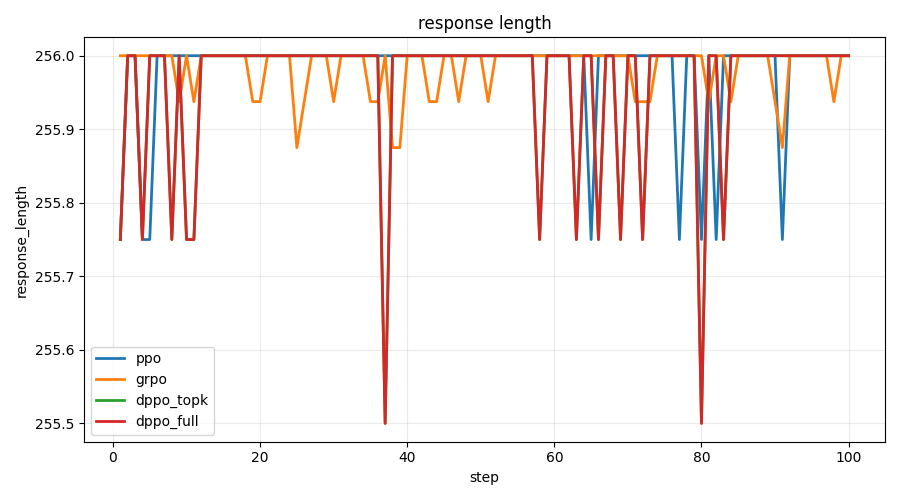
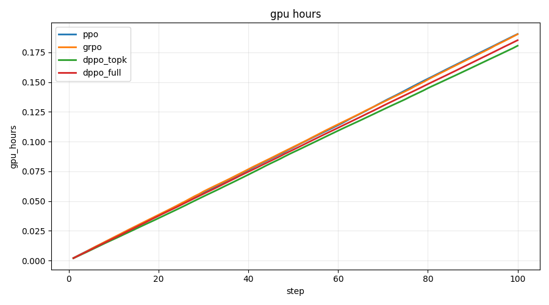
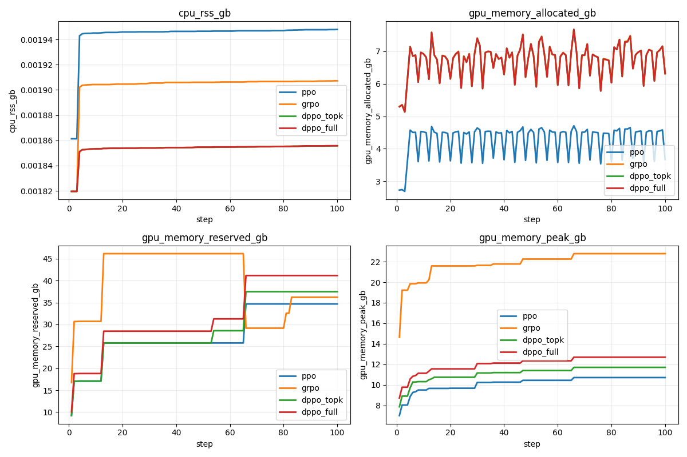

# dppo

This is a small controlled RL post-training experiment on a GSM8K subset. It compares PPO, GRPO, DPPO-topk, and DPPO-full on one GPU. It is not a full benchmark and it is not a distributed training stack.

> this repo is meant to be easy to inspect end to end: small dataset slice, one base model, rule-based reward, tracked metrics, and pushed model artifacts.

> the DPPO setup here is inspired by the paper [DPPO: divergence-constrained policy optimization](https://arxiv.org/abs/2602.04879), but the code here is intentionally small and practical rather than a full reproduction.

## What is here

- `scripts/prepare_gsm8k.py` writes the default `400/100` GSM8K subset to `data/processed/`.
- `scripts/train_ppo.py` runs a minimal reward-only PPO loop.
- `scripts/train_grpo.py` runs grouped sampling with group-relative normalized advantages.
- `scripts/train_dppo.py` runs PPO-style updates with either top-k divergence masking or full-vocab divergence masking.
- `scripts/eval_model.py` evaluates a saved checkpoint on the prepared eval split.
- `scripts/run_train_eval_publish.sh` runs train, eval, cleanup, plotting, git push, and HF model-card publish in one flow.
- `scripts/plot_results.py` writes only the informative per-metric PNGs from logged metrics.

## Setup

```bash
python -m venv .venv
source .venv/bin/activate
pip install -r requirements.txt
```

The scripts use `.env` for `HF_USERNAME`, `HF_TOKEN`, and optionally `GITHUB_TOKEN` and `HF_COLLECTION_URL`.

## Expected hardware

This code expects one CUDA GPU. The target is one L40S 48GB card. Training scripts stop early with a short message if CUDA is missing.

## Quick run

```bash
python scripts/prepare_gsm8k.py --config configs/base.yaml
python scripts/plot_results.py --outputs-root outputs --save-dir outputs/plots
```

single-line dppo top-k train:

```bash
python scripts/train_dppo.py --config configs/base.yaml --config configs/dppo_topk.yaml --output-dir outputs/dppo_topk --run-name dppo-topk
```

single-line dppo full-divergence train:

```bash
python scripts/train_dppo.py --config configs/base.yaml --config configs/dppo_full.yaml --output-dir outputs/dppo_full --run-name dppo-full
```

single-line eval:

```bash
python scripts/eval_model.py --config configs/base.yaml --model-path outputs/dppo_topk/final_model --output-dir outputs/dppo_topk_eval
```

full pipeline:

```bash
bash scripts/run_train_eval_publish.sh
```

## Hub Models

- 🤗 [ppo](https://huggingface.co/Pradheep1647/qwen2.5-0.5b-instruct-openai-gsm8k-ppo)
- 🤗 [grpo](https://huggingface.co/Pradheep1647/qwen2.5-0.5b-instruct-openai-gsm8k-grpo)
- 🤗 [dppo-topk](https://huggingface.co/Pradheep1647/qwen2.5-0.5b-instruct-openai-gsm8k-dppo-topk)
- 🤗 [dppo-full](https://huggingface.co/Pradheep1647/qwen2.5-0.5b-instruct-openai-gsm8k-dppo-full)

## Plots

> these are the plots worth looking at from the current runs. the noisier or degenerate policy-movement plots were removed from the default README surface because they were not adding useful signal.

<table>
  <tr>
    <td></td>
    <td></td>
  </tr>
  <tr>
    <td></td>
    <td></td>
  </tr>
  <tr>
    <td></td>
    <td></td>
  </tr>
  <tr>
    <td colspan="2"></td>
  </tr>
</table>

> train reward, eval accuracy, and eval reward are the main outcome metrics. response length and entropy help show generation behavior, while gpu-hours and system-usage plots show the practical runtime cost of each method.

## Reward

- `+1.0` if the final numeric answer matches GSM8K.
- `+0.1` if the output has a parseable final answer after `####`.
- `0.0` otherwise.

The prompt always asks for step-by-step work and a final answer after `####`.

## Notes

- The trainers use policy-gradient style updates on generated tokens only.
- PPO uses clipped ratio updates and logs `kl_mean`, `entropy_mean`, and `clip_fraction`.
- GRPO samples four completions per prompt and normalizes rewards within each prompt group.
- DPPO can run either `topk` divergence masking or full-vocab TV divergence masking.
- Logs are written to both `jsonl` and `csv` under `outputs/<algo>/`.
- Final checkpoints are pushed to repos named like `hf-username/qwen2.5-0.5b-instruct-gsm8k-ppo`.
- Each run also writes `outputs/<algo>/training.log` as JSONL, logs scalars to TensorBoard under `outputs/<algo>/tb/`, and uploads `training.log` with the pushed model.
- `scripts/pull_model.py` downloads a pushed Hub model repo using `HF_USERNAME` and `HF_TOKEN` from `.env`.
- `scripts/publish_model_card.py` pulls the Hub repo, plots only the useful tracked metrics from `training.log`, rewrites the autogenerated model card to a minimal tagged version, and uploads the new `README.md` plus plot.
- if you later create an HF collection, pass `--collection-url ...` or set `HF_COLLECTION_URL` and it will be linked from the model card.
- `scripts/plot_results.py` now includes `dppo_full` by default, reads `training.log` when present, and keeps only the informative default plots: `train_reward.png`, `eval_acc.png`, `eval_reward.png`, `entropy_mean.png`, `response_length.png`, `gpu_hours.png`, and `system_usage.png`.
